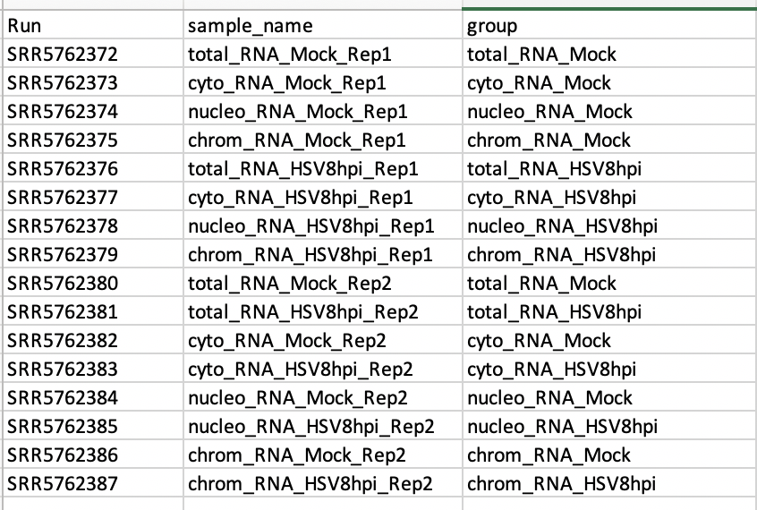
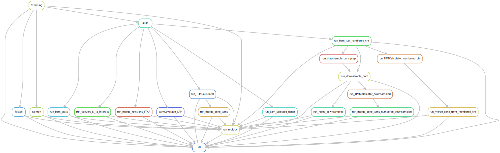

---- UNDER CONSTRUCTION ----


# rna_seq_standard_pipeline

Snakemake workflow to analyze bulk RNA-seq. This is largerly inspired by https://github.com/snakemake-workflows.

## Samples config 

The sample spreadsheet specified in config.yaml has to be formatted like:



The config file should hold the following fields (this example is for hg38, but can be replaced for any other version/ species):

```bash
(snakemake) [hayerk@reslnvvhpc041 endpoints]$ head config/config.yaml
samples: config/SraRunTable.csv
star_index: /path/to/GENCODE_GRCh38.p13
salmon_index: /path/to/gencode.v30.transcripts_salmon
blacklist: /path/to/hg38-blacklist.v2.bed
gtf: /path/to/gencode.v32.primary_assembly.annotation.gtf
gff3: /path/to/gencode.v32.primary_assembly.annotation.gff3
tmp_dir: /scr1/users/hayerk/tmp
single_end: False
stranded: False
```

## Folder structure

```bash
├── reads/ -> fastqfiles
├── config/
	├──samples.csv
	├── config.yaml
```

 ### Slurm (or other cluter) profile

    (snakemake) [hayerk@reslnvvhpc041 endpoints]$ head ~/.config/snakemake/slurm/config.yaml
    jobs: 500
    cluster: "sbatch -t {resources.time} --mem={resources.mem}G -c {resources.cpu} -J sm_{rule} -o logs_slurm/{rule}_{wildcards}.o -e logs_slurm/{rule}_{wildcards}.e" #--mail-type=FAIL --mail-user=hayerk@chop.edu"
    default-resources: [ mem=10, time=60, cpu=1]
    #resources: [cpus=30, mem_mb=500000]
	
## Testing 
    
    snakemake --configfile config/config.yaml -n

## Submit to cluster

    snakemake --profile slurm -s ~/data/tools/rna_seq_standard_pipeline/workflow/Snakefile -p --use-conda --configfile config/config.yaml


## Make this rulegraph

    snakemake --configfile config/config.yaml --use-conda --rulegraph | dot -Tsvg > misc/dag.svg



## TODO

- Fix strand information (especially in regtools!)
- Fix STAR sorting (with samtools so it does not run out of memory)

