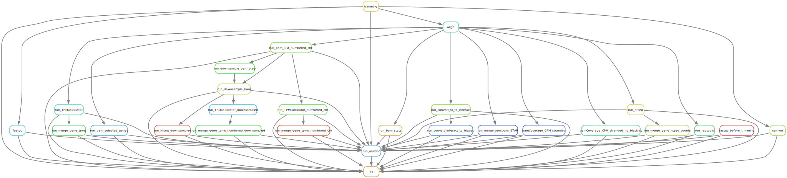

# UNDER CONSTRUCTION

# rna_seq_standard_pipeline

Snakemake workflow to analyze bulk RNA-seq 

This is largerly inspired by https://github.com/snakemake-workflows.

## Samples config 

The sample spreadsheet specified in config.yaml has to be formatted like:

 ### Slurm (or other cluter) profile

    (snakemake) [hayerk@reslnvvhpc041 endpoints]$ head ~/.config/snakemake/slurm/config.yaml
    jobs: 500
    cluster: "sbatch -t {resources.time} --mem={resources.mem} -c {resources.cpu} -o logs_slurm/{rule}_{wildcards}.o -e logs_slurm/{rule}_{wildcards}.e" #--mail-type=FAIL --mail-user=hayerk@chop.edu"
    default-resources: [ mem=2000, time=60, cpu=1]
    #resources: [cpus=30, mem_mb=500000]
	
## Testing 
    
    snakemake --configfile config/config.yaml -n

## Submit to cluster

    snakemake --profile slurm -s ~/data/tools/rna_seq_standard_pipeline/workflow/Snakefile -p --use-conda --configfile config/config.yaml

## Make this rulegraph

    snakemake --configfile config/config.yaml --use-conda --rulegraph | dot -Tsvg > dag.svg

